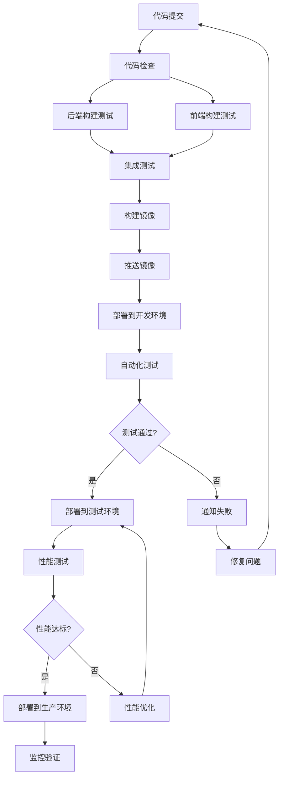

# I-003 CI/CD流水线搭建任务交接文档

## 📋 任务概述

**任务ID**: I-003  
**任务名称**: CI/CD流水线搭建  
**负责人**: 🛠️ 稳当 (基础设施工程师)  
**预计工时**: 3小时  
**优先级**: P1  
**开始时间**: Day 2 15:00  
**完成时间**: Day 2 18:00  

## 🎯 任务目标

搭建完整的CI/CD流水线，实现：
- **自动化构建**: 前后端代码自动编译和打包
- **自动化测试**: 运行单元测试和集成测试
- **自动化部署**: 支持多环境部署(开发/测试/生产)
- **质量门禁**: 代码质量检查和性能监控
- **回滚机制**: 支持快速回滚到稳定版本

## 🔧 技术栈分析

### 后端技术栈
- **语言**: Go 1.21
- **框架**: Gin Web框架
- **数据库**: SQLite (开发) / PostgreSQL (生产)
- **ORM**: GORM
- **构建工具**: Go Modules
- **测试框架**: Go testing
- **容器化**: Docker

### 前端技术栈
- **框架**: Vue 3 + TypeScript
- **构建工具**: Vite
- **UI框架**: Tailwind CSS
- **测试框架**: Vitest
- **代码质量**: ESLint + Prettier
- **包管理**: npm

### 现有基础设施
- **版本控制**: Git + GitHub
- **容器化**: Docker + Docker Compose
- **监控**: Grafana + Prometheus + Loki
- **现有CI**: 部分GitHub Actions配置已存在

## 📊 CI/CD流水线设计

### 流水线阶段设计



### 具体实施步骤

#### 阶段1: 代码质量检查 (5分钟)
```yaml
# GitHub Actions: 代码检查
- 代码格式检查 (Go fmt, ESLint)
- 静态代码分析 (golangci-lint, SonarQube)
- 安全漏洞扫描 (Dependabot, Snyk)
- 依赖项安全检查
```

#### 阶段2: 自动化测试 (15分钟)
```yaml
# 后端测试
- 单元测试: go test ./...
- 集成测试: API接口测试
- 数据库迁移测试
- WebSocket连接测试

# 前端测试  
- 单元测试: vitest
- E2E测试: Playwright/Cypress
- 组件测试: Vue Test Utils
- 类型检查: TypeScript
```

#### 阶段3: 构建和打包 (10分钟)
```yaml
# 后端构建
- Go构建: CGO_ENABLED=0 GOOS=linux go build
- Docker镜像: 多阶段构建优化
- 镜像扫描: Trivy安全扫描

# 前端构建
- 依赖安装: npm ci
- 构建打包: npm run build
- 资源优化: Vite生产构建
- 缓存优化: 依赖缓存
```

#### 阶段4: 部署流水线 (15分钟)
```yaml
# 环境管理
- 开发环境: 自动部署
- 测试环境: 手动触发
- 生产环境: 审批后部署

# 部署策略
- 蓝绿部署: 零停机部署
- 滚动更新: 渐进式更新
- 回滚机制: 快速回滚
```

## 🛠️ 具体实施任务

### 任务1: 完善GitHub Actions配置 (45分钟)

**现有文件检查**:
```bash
# 检查现有CI配置
ls -la .github/workflows/
cat .github/workflows/ci.yml
```

**需要完善的配置**:
```yaml
# .github/workflows/ci.yml - 完整配置
name: CI/CD Pipeline

on:
  push:
    branches: [ main, develop ]
  pull_request:
    branches: [ main ]

env:
  GO_VERSION: '1.21'
  NODE_VERSION: '18'

jobs:
  # 代码质量检查
  lint-and-security:
    runs-on: ubuntu-latest
    steps:
      - uses: actions/checkout@v4
      
      - name: Setup Go
        uses: actions/setup-go@v4
        with:
          go-version: ${{ env.GO_VERSION }}
          
      - name: Setup Node.js
        uses: actions/setup-node@v4
        with:
          node-version: ${{ env.NODE_VERSION }}
          cache: 'npm'
          cache-dependency-path: frontend/package-lock.json
          
      # 后端代码检查
      - name: Go Lint
        run: |
          go install github.com/golangci/golangci-lint/cmd/golangci-lint@latest
          golangci-lint run
          
      - name: Go Security Scan
        run: |
          go install github.com/securecodewarrior/gosec/v2/cmd/gosec@latest
          gosec ./...
          
      # 前端代码检查
      - name: Frontend Lint
        run: |
          cd frontend
          npm ci
          npm run lint
          
      - name: Frontend Format Check
        run: |
          cd frontend
          npm run format -- --check
```

### 任务2: 后端测试流水线 (30分钟)

```yaml
  # 后端测试
  backend-test:
    runs-on: ubuntu-latest
    services:
      postgres:
        image: postgres:15
        env:
          POSTGRES_PASSWORD: test
          POSTGRES_DB: test
        options: >-
          --health-cmd pg_isready
          --health-interval 10s
          --health-timeout 5s
          --health-retries 5
          
    steps:
      - uses: actions/checkout@v4
      
      - name: Setup Go
        uses: actions/setup-go@v4
        with:
          go-version: ${{ env.GO_VERSION }}
          
      - name: Cache Go modules
        uses: actions/cache@v3
        with:
          path: |
            ~/.cache/go-build
            ~/go/pkg/mod
          key: ${{ runner.os }}-go-${{ hashFiles('**/go.sum') }}
          restore-keys: |
            ${{ runner.os }}-go-
            
      - name: Run tests
        run: |
          cd backend
          go test -v -race -coverprofile=coverage.out ./...
          
      - name: Upload coverage
        uses: codecov/codecov-action@v3
        with:
          file: ./backend/coverage.out
          flags: backend
```

### 任务3: 前端测试流水线 (30分钟)

```yaml
  # 前端测试
  frontend-test:
    runs-on: ubuntu-latest
    steps:
      - uses: actions/checkout@v4
      
      - name: Setup Node.js
        uses: actions/setup-node@v4
        with:
          node-version: ${{ env.NODE_VERSION }}
          cache: 'npm'
          cache-dependency-path: frontend/package-lock.json
          
      - name: Install dependencies
        run: |
          cd frontend
          npm ci
          
      - name: Type check
        run: |
          cd frontend
          npm run type-check
          
      - name: Run tests
        run: |
          cd frontend
          npm run test:coverage
          
      - name: Upload coverage
        uses: codecov/codecov-action@v3
        with:
          file: ./frontend/coverage/lcov.info
          flags: frontend
```

### 任务4: 构建和部署流水线 (45分钟)

```yaml
  # 构建和部署
  build-and-deploy:
    needs: [lint-and-security, backend-test, frontend-test]
    runs-on: ubuntu-latest
    if: github.ref == 'refs/heads/main'
    
    steps:
      - uses: actions/checkout@v4
      
      - name: Setup Docker Buildx
        uses: docker/setup-buildx-action@v3
        
      - name: Login to Docker Hub
        uses: docker/login-action@v3
        with:
          username: ${{ secrets.DOCKER_USERNAME }}
          password: ${{ secrets.DOCKER_PASSWORD }}
          
      # 构建后端镜像
      - name: Build backend image
        uses: docker/build-push-action@v5
        with:
          context: ./backend
          file: ./backend/Dockerfile
          push: true
          tags: |
            xiaowo/backend:${{ github.sha }}
            xiaowo/backend:latest
          cache-from: type=gha
          cache-to: type=gha,mode=max
          
      # 构建前端镜像
      - name: Build frontend image
        uses: docker/build-push-action@v5
        with:
          context: ./frontend
          file: ./frontend/Dockerfile
          push: true
          tags: |
            xiaowo/frontend:${{ github.sha }}
            xiaowo/frontend:latest
          cache-from: type=gha
          cache-to: type=gha,mode=max
          
      # 部署到开发环境
      - name: Deploy to dev
        run: |
          echo "部署到开发环境"
          # kubectl apply -f k8s/dev/
          
      # 运行冒烟测试
      - name: Smoke tests
        run: |
          echo "运行冒烟测试"
          # curl -f http://dev.xiaowo.com/health
```

### 任务5: 环境和配置管理 (30分钟)

**创建环境配置文件**:
```bash
# 创建环境配置目录
mkdir -p .github/environments/{dev,staging,prod}

# 开发环境配置
cat > .github/environments/dev/deployment.yml << EOF
environment: development
cluster: xiaowo-dev-cluster
namespace: xiaowo-dev
replicas:
  backend: 2
  frontend: 2
resources:
  cpu: 100m
  memory: 128Mi
EOF

# 测试环境配置
cat > .github/environments/staging/deployment.yml << EOF
environment: staging
cluster: xiaowo-staging-cluster
namespace: xiaowo-staging
replicas:
  backend: 3
  frontend: 3
resources:
  cpu: 200m
  memory: 256Mi
EOF

# 生产环境配置
cat > .github/environments/prod/deployment.yml << EOF
environment: production
cluster: xiaowo-prod-cluster
namespace: xiaowo-prod
replicas:
  backend: 5
  frontend: 5
resources:
  cpu: 500m
  memory: 512Mi
EOF
```

### 任务6: 监控和通知配置 (30分钟)

**添加部署通知**:
```yaml
  # 部署通知
  notify:
    runs-on: ubuntu-latest
    needs: build-and-deploy
    if: always()
    
    steps:
      - name: Notify deployment status
        uses: 8398a7/action-slack@v3
        with:
          status: ${{ job.status }}
          channel: '#devops'
          webhook_url: ${{ secrets.SLACK_WEBHOOK }}
          fields: repo,message,commit,author,action,eventName,ref,workflow
```

## 📋 验收标准

### 功能验收标准
- [ ] GitHub Actions流水线正常运行
- [ ] 代码提交后自动触发构建和测试
- [ ] 后端单元测试覆盖率 ≥80%
- [ ] 前端测试覆盖率 ≥80%
- [ ] 自动化部署到开发环境成功
- [ ] 支持手动部署到测试和生产环境
- [ ] 部署失败时自动回滚
- [ ] 性能监控指标正常

### 质量验收标准
- [ ] 代码质量检查通过 (golangci-lint, ESLint)
- [ ] 安全扫描无高危漏洞
- [ ] 镜像大小优化 (后端<50MB, 前端<20MB)
- [ ] 构建时间 <5分钟
- [ ] 部署时间 <3分钟

### 运维验收标准
- [ ] 监控告警配置完成
- [ ] 日志收集配置完成
- [ ] 备份策略配置完成
- [ ] 文档更新完成

## 🚨 注意事项

### 1. 安全配置
- **Secrets管理**: 所有敏感信息使用GitHub Secrets
- **权限控制**: 最小权限原则
- **镜像扫描**: 必须通过安全扫描才能部署
- **依赖更新**: 定期更新依赖包

### 2. 性能优化
- **缓存策略**: 充分利用GitHub Actions缓存
- **并行执行**: 独立任务并行运行
- **镜像优化**: 多阶段构建，减少镜像大小
- **资源限制**: 合理配置job资源限制

### 3. 错误处理
- **失败通知**: 及时通知相关人员
- **重试机制**: 网络问题自动重试
- **日志记录**: 详细的构建和部署日志
- **回滚准备**: 始终保持可回滚状态

### 4. 团队协作
- **文档更新**: 及时更新部署文档
- **知识分享**: 向团队介绍新流水线
- **培训计划**: 确保团队成员熟悉CI/CD流程

## 🔗 相关文档链接

- [现有CI配置](.github/workflows/ci.yml)
- [后端Dockerfile](../backend/Dockerfile)
- [前端Dockerfile](../frontend/Dockerfile)
- [Docker Compose配置](../docker-compose.yml)
- [监控配置](../monitoring/)
- [项目架构文档](../architecture/00_完整架构设计文档.md)

## 📞 支持与联系

如遇到技术问题，请联系：
- **技术架构**: 🏗️ 老架
- **前端开发**: 🎨 阿码
- **后端开发**: 🛡️ 后盾
- **项目管理**: 管家

---

**文档版本**: v1.0  
**创建时间**: 2025-12-31 15:00  
**创建者**: 管家 (项目管理员)  
**预计完成时间**: 2025-12-31 18:00
